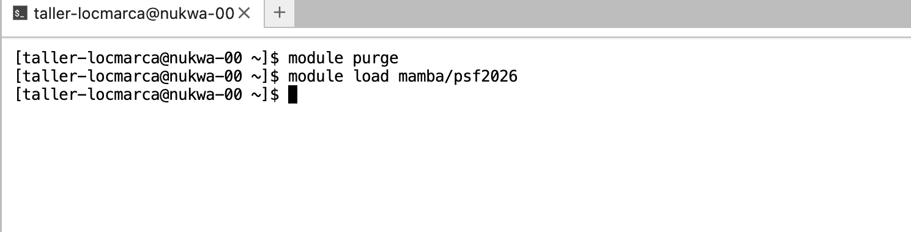
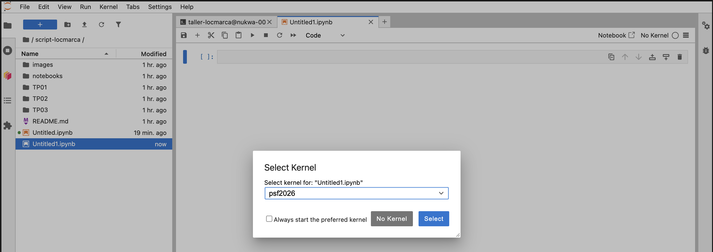

# Material for the LOCMARCA workshop

This repo contains the material that will used during the next LOCMARCA workshop, from 16 to 20 November 2026 in Costa Rica.
## 1. Program : [here](https://docs.google.com/document/d/1cB4yNvkBNWdxjOYhjzKJLcO5nfagvkhRv2tHxbG7s0o/edit?tab=t.0)

## 2. Connexion to JupyterLab

> [!NOTE]
> This section must be repeated every time you connect.

You need 2 ingredients :
- the connexion to JupyterLab of Kabre HPC cluster : [ondemand.kabre.cenat.ac.cr](https://ondemand.kabre.cenat.ac.cr)
- your login and password : as *`taller-locmarcaXXX`* and *`yourpassword`*

### Step-by-step 
- step 1 connect to the onDemand JupyterLab of Kabre


- step 2 : launch a Jupyter Notebook


- step 3 : launch a Jupyther Notebook 


- step 4 : launch a "modern" JupyterLab (not Jupyther Notebook)


- step 5 : various type of sessions


- step 6 : lauch a  terminal session


> [!NOTE]
> Steps 3 and 4 are one-time setup steps: you only need to do them the first time you connect. In future sessions, you can skip directly to your notebooks.

## 3. Download the courses and hands-on notebooks using GIT

> [!NOTE]
> Sections 3 need to be done during your first connection.

Open a terminal and clone the github repository for the workshop : https://github.com/gcambon/script-locmarca 

```bash
git clone  https://github.com/gcambon/script-locmarca.git
```


## 4. Bash environment

> [!NOTE]
> Sections 4 need to be done during your first connection.

To setup your bash environment, with some useful aliases, prompt, modules loading etc...,  you will need do 2 simple manipulations :

```bash
cd $HOME
cp /data/gcambon/COMMONDATA/Setup_training/p.bash_profile .bash_profile
cp /data/gcambon/COMMONDATA/Setup_training/p.bashrc .bashrc
```

You can check the configuration with:

- Aliases: type `alias`
- Loaded modules: type `module list`

## 5. Python environment

> [!NOTE]
> This section must be repeated every time you connect.

To access all the required Python packages and other programs, you will use the `psf2026` Python environment, specifically configured for the workshop.

> [!NOTE]
> This environment is loaded automatically when you open a terminal, via the `.bashrc` configuration and the module command: `module load mamba/psf2026`. You do not need to run this command yourself.
<!--  -->

In a Jupyter notebook, select the `psf2026` kernel.



## 6. Course material

Lecture slides are available in the `Courses/` folder (or linked below):
- [Course 1 — Introduction](Courses/course01.pdf)
- [Course 2 — ...](Courses/course02.pdf)

## 7. Hands-on sessions

Before starting each session, make sure you have the latest version of the material:

```bash
cd script-locmarca
git pull
```

Then, make a copy of the notebook to work on. For example, for Session 1:

```bash
cp Session01/session01.ipynb Session01/session01_mysolution.ipynb
```

Open `Session01/session01_mysolution.ipynb` in JupyterLab and follow the instructions inside.

> [!NOTE]
> Repeat this pattern for every new session: `git pull`, then copy `SessionXX/sessionXX.ipynb` to `SessionXX/sessionXX_mysolution.ipynb`.
