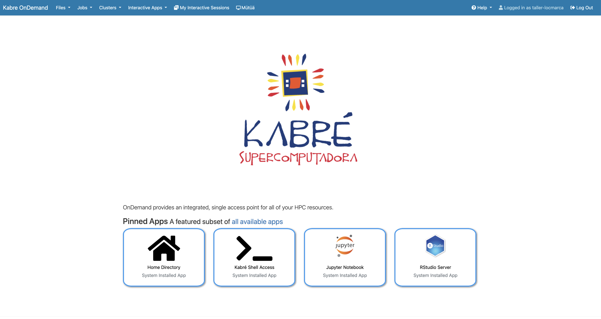
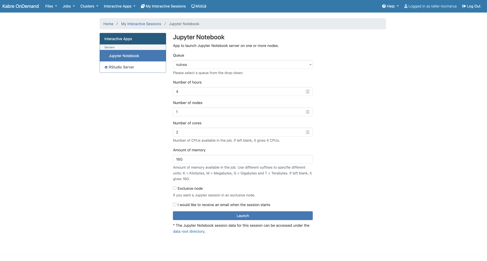
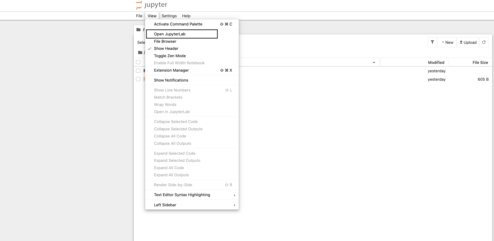
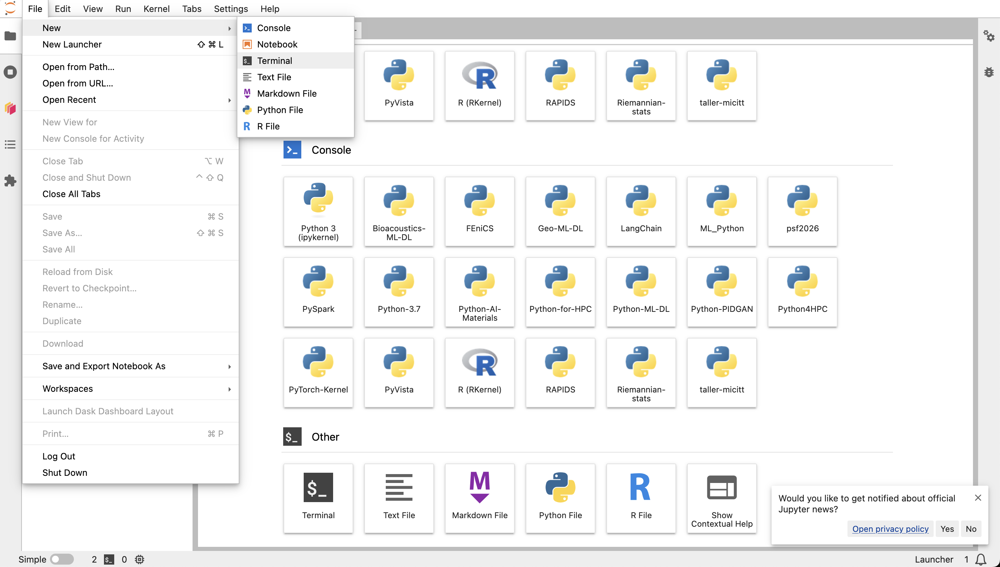
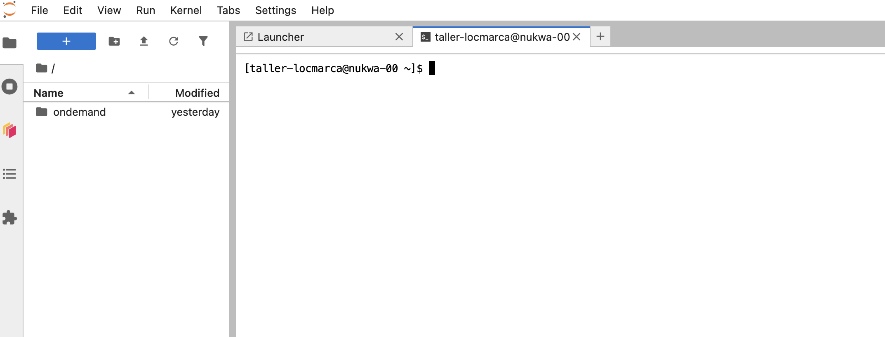
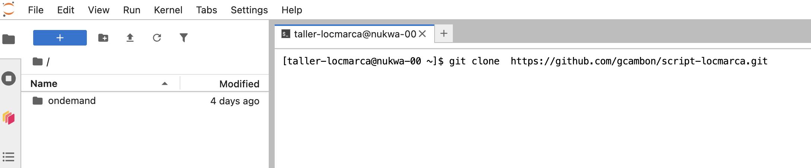

# Material for the LOCMARCA workshop

This repo contains the material that will used during the next LOCMARCA workshop, from 16 to 20 Novemeber in Costa Rica. 
Click on the link to access the notebook corresponding to the session :

## Program : [here](https://docs.google.com/document/d/1cB4yNvkBNWdxjOYhjzKJLcO5nfagvkhRv2tHxbG7s0o/edit?tab=t.0)


## Connexion to JupyterLab

You need 2 ingredients :
- the connexion to JupyterLab of Kabre HPC cluster : [ondemand.kabre.cenat.ac.cr](https://ondemand.kabre.cenat.ac.cr)
- your login and password : as *`taller-locmarcaXXX`* and *`yourpassword`*

### Step by step 
- step 1 connect to the onDemand JupyterLab of Kabre



- step 2 : launch a Jupyter Notebook



- step 3 : launch a Jupyther Notebook 


- step 4 : launch a "modern" JupyterLab (not Jupyther Notebook)



- step 5 : various type of sessions



- step 6 : lauch a  terminal session




## Download the courses and hands-on notebooks using GIT

Open a terminal and clone the github repository for the workshop : https://github.com/gcambon/script-locmarca 

```
git clone  https://github.com/gcambon/script-locmarca.git
```

