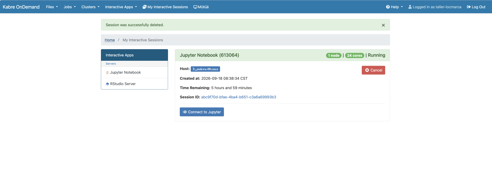

# Material for the LOCMARCA workshop

This repo contains the material that will used during the next LOCMARCA workshop, from 16 to 20 Novemeber in Costa Rica. 
Click on the link to access the notebook corresponding to the session :

## Program : [here](https://docs.google.com/document/d/1cB4yNvkBNWdxjOYhjzKJLcO5nfagvkhRv2tHxbG7s0o/edit?tab=t.0)


## Connexion to jupyterhub

You need 2 ingredients :
- the connexion to jupyterhub of Kabre HPC cluster : [ondemand.kabre.cenat.ac.cr](https://ondemand.kabre.cenat.ac.cr)
- your login and password : as *`taller-locmarcaXXX`* and *`yourpassword`*

### Step by step 
1. step 1 connect to the jupytherlab


2. step 2 : launch a Jupyther Notebook sesssion


3. step 3 : launch a Jupyther Notebook sesssion


4. step 4 : launch modern jupyterhub


5. step 5 : various type of sessions


6. step 6 : lauch a  terminal session


# Download the courses and hands-on notebooks using GIT

Open a terminal

```
mkdir work
git clone  https://github.com/gcambon/script-locmarca.git
```
