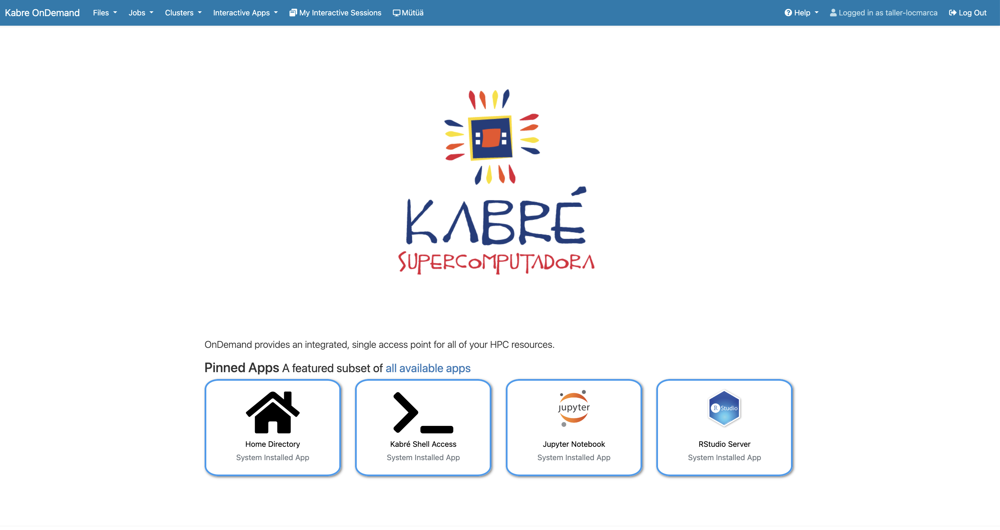
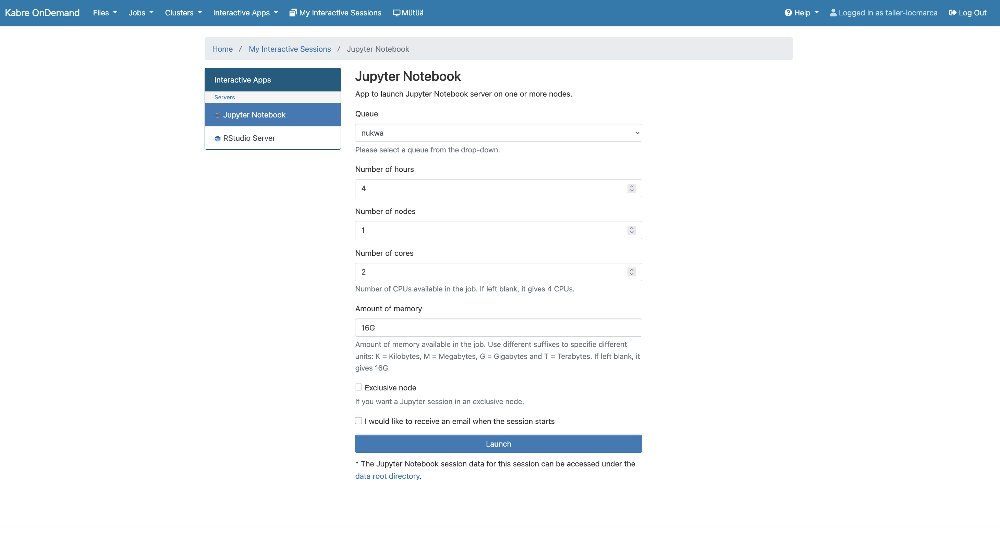
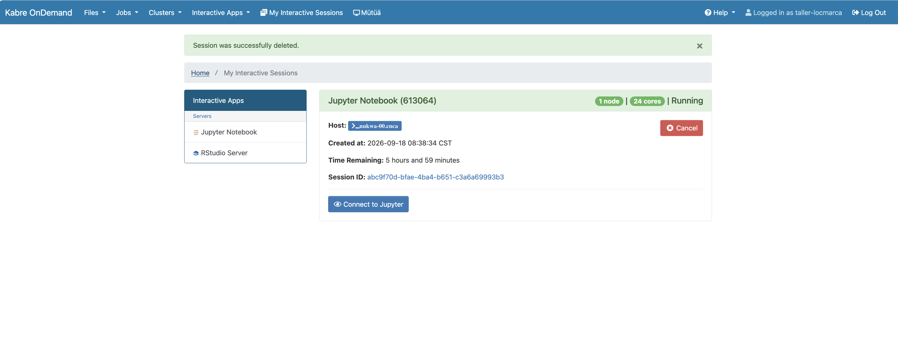
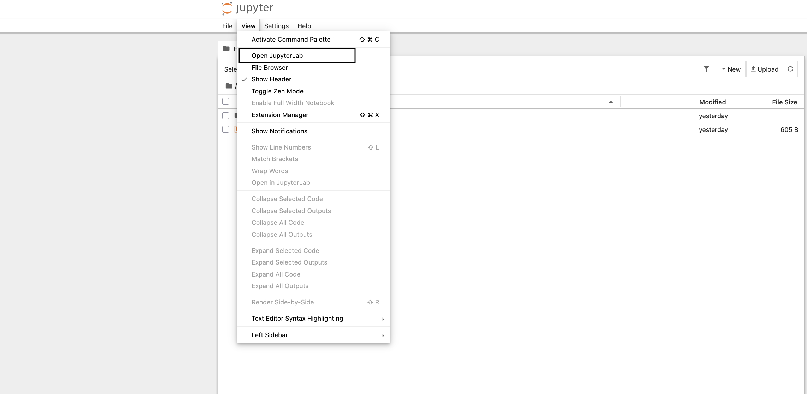
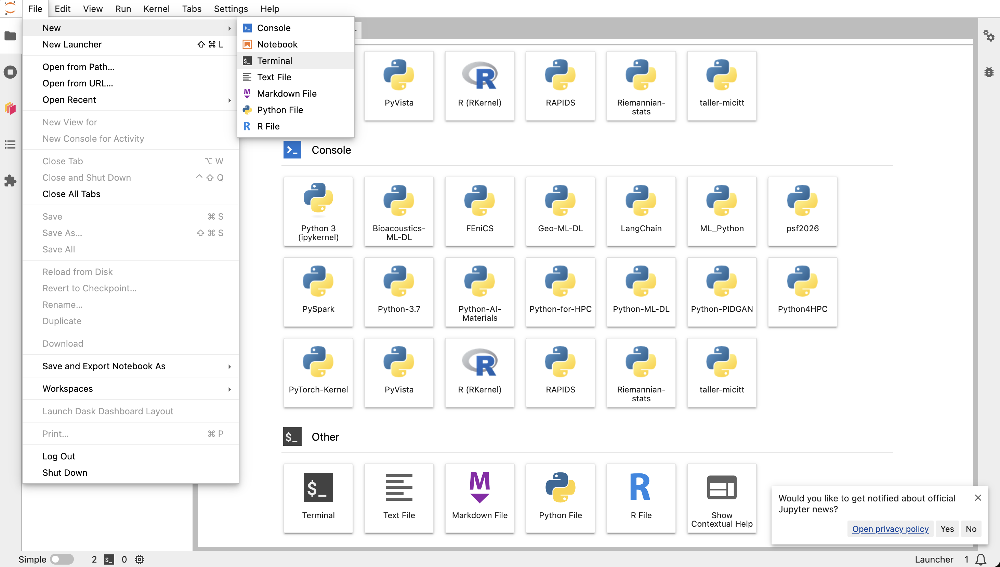
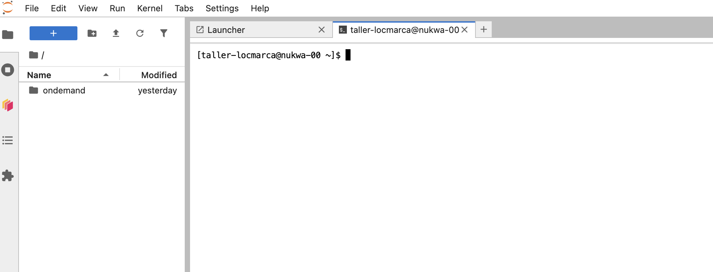

## Connection to JupyterLab

> [!NOTE]
> Do this **every time** you connect.

You need 2 ingredients:
- the address of the JupyterLab service of the Kabre HPC cluster: [ondemand.kabre.cenat.ac.cr](https://ondemand.kabre.cenat.ac.cr)
- your login and password: *`taller-locmarcaXXX`* and *`yourpassword`*

### Step by step

- **Step 1**: connect to Kabre OnDemand with your login and password.

- **Step 2**: in *Interactive Apps*, choose **Jupyter Notebook**, check the queue, the number of hours and of cores, then click **Launch**.

- **Step 3**: in *My Interactive Sessions*, wait until your session is **Running**, then click **Connect to Jupyter**.

- **Step 4**: if the classic Jupyter page opens, switch to the modern interface: **View → Open JupyterLab**.

- **Step 5**: JupyterLab opens on the **Launcher**, with the different types of sessions (notebooks, consoles, terminal). For the workshop, always use the **`psf2026`** kernel (see [Python environment](python_env.md)).

- **Step 6**: to open a terminal: **File → New → Terminal**.

> [!NOTE]
> Your session stops when the number of hours chosen in step 2 is over. Save your notebooks regularly.
