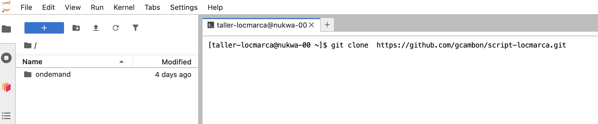

### Download the courses and hands-on notebooks with git

> [!NOTE]
> Do this **only once**, at your first connection.

Open a terminal (*File → New → Terminal*) and clone the GitHub repository of the workshop, <https://github.com/gcambon/script-locmarca>:

```bash
cd $HOME
git clone https://github.com/gcambon/script-locmarca.git
```



To get the latest version of the material before each session, see [Hands-on sessions](handson_session.md).
