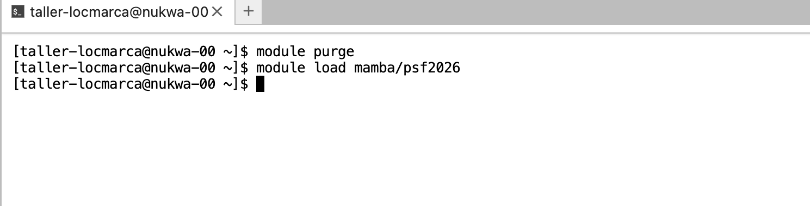
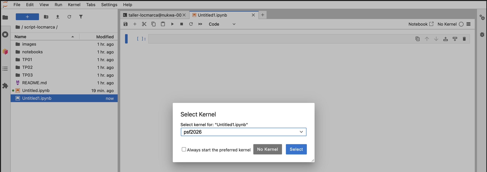

### Python environment

To access all the Python packages and programs of the workshop, you use the **`psf2026`** Python environment, configured specifically for the workshop.

> [!NOTE]
> In a terminal, this environment is loaded automatically, via the `.bashrc` configuration ([Bash environment](bash_env.md)) and the command `module load mamba/psf2026`. You do not need to run this command yourself.
<!--  -->

In a Jupyter notebook, select the **`psf2026`** kernel (top right of the notebook). Check it **every time** you open a notebook.

